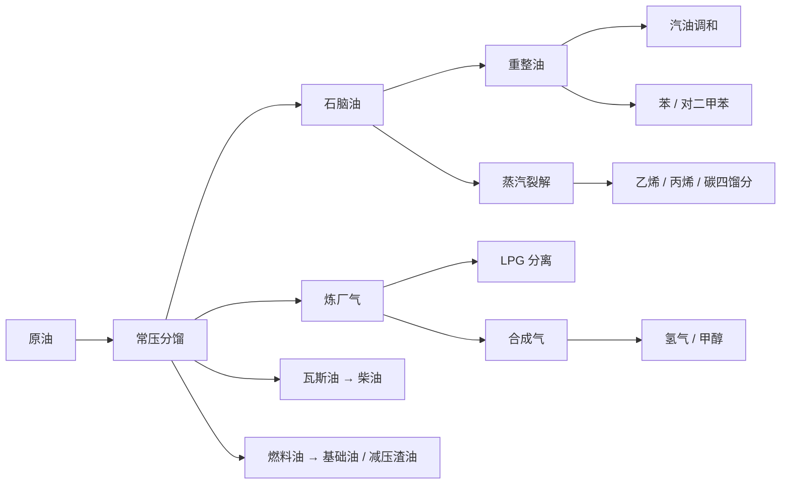

# 石化与化工深化（2026-09-10）

## 已实现功能

本批调整 36 条默认配方，新增 9 条配方及 7 种中间品。新物品已注册，加入主创造模式页和化工分类，具有市场初始价格、中英文名称及有效模型。模型复用现有化工容器纹理，尚未为新材料单独绘制图标。

| 新增物品 | 生产与用途 |
|---|---|
| 合成气 `syngas` | 炼厂气重整或煤气化 → 合成气；进入制氢分离、甲醇合成。 |
| 重整油 `reformate` | 石脑油催化重整 → 重整油；分别用于汽油调和、苯和对二甲苯分离。 |
| 碳四馏分 `c4_fraction` | 石脑油裂解联产；用于丁二烯提取。 |
| 乙苯 `ethylbenzene` | 苯与乙烯 → 乙苯 → 苯乙烯，后段联产氢气。 |
| 丙烯腈 `acrylonitrile` | 丙烯、氨和氧 → 丙烯腈；与丁二烯、苯乙烯共同进入 ABS。 |
| 双酚 A `bisphenol_a` | 苯酚与丙酮 → 双酚 A；进入环氧树脂。 |
| 环氧氯丙烷 `epichlorohydrin` | 丙烯、氯、烧碱和水经简化工艺制取；与双酚 A、烧碱共同进入环氧树脂。 |

### 炼油与燃料

旧 `refining` 改为分馏入口，不再一次产出汽油、柴油、LPG、基础油和沥青。常压分馏提供炼厂气、石脑油、煤油、瓦斯油和燃料油；瓦斯油加氢进入柴油，燃料油减压分馏进入基础油和减压渣油，渣油进入沥青。

- 新增 `refinery_gas_fractionation` 和 `gasoline_blending`，把物理分离与化学转化的用途区分开。
- 炼厂气重整只提供合成气，不再同时“制造”LPG。
- 保留 `benzene_reforming`、`aromatics_reforming` 等历史配方 ID，改为承接重整油的芳烃分离。
- 润滑油旧配方改为基础油加氢处理，不再靠加入燃料油直接完成。
- 新增配方插在常压分馏之后，保持石化行业首个默认配方为 `atmospheric_distillation`。

EIA 将炼油过程概括为分离、转化和处理；本批使用这个阶段结构，但没有模拟真实馏程或燃油规格。[EIA 炼油流程](https://www.eia.gov/energyexplained/oil-and-petroleum-products/refining-crude-oil-the-refining-process.php)

### 制氢、甲醇与化肥

- 新增煤气化、合成气变换分离、水电解路线。合成气分离联产氢气和二氧化碳。
- 甲醇保留合成气路线及二氧化碳加氢路线，任何一条缺少原料时都能选择另一条；不是强制所有甲醇都经过单一路径。
- 硝酸接入氨与氧，尿素接入氨与二氧化碳，碳酸氢钠补入二氧化碳。
- 空气压缩从环境空气取料，消耗已有机器运营费用，不再消耗玻璃和水；旧空分配方改为使用压缩空气及专用空分设备。
- 无原油供应时，原版煤、水及空分等来源仍能支撑非石油制氢与尿素链的材料可达性。

DOE 的制氢说明介绍了重整、变换和气体分离阶段；这里将其缩成可玩的生产批次。[DOE 重整制氢](https://www.energy.gov/cmei/fuels/hydrogen-production-natural-gas-reforming) 硝酸原料调整参考 EPA 对氨催化氧化路线的说明。[EPA 硝酸生产](https://www.epa.gov/ghgreporting/subpart-v-nitric-acid-production)

### 烯烃、芳烃与树脂

- 两条裂解配方都需要石脑油与水，并联产乙烯、丙烯、碳四馏分和炼厂气。丁二烯从碳四馏分提取。
- 橡胶接入丁二烯和苯乙烯；ABS 接入丙烯腈、丁二烯和苯乙烯。
- 乙二醇接入环氧乙烷，环氧乙烷补入氧；环氧丙烷接入过氧化氢。
- 苯酚 / 丙酮路线补入氧；酚醛树脂的旧配方必须使用甲醛，甲醛路线改为甲醇与氧。
- 环氧树脂使用双酚 A、环氧氯丙烷和烧碱，取代“乙二醇 + 通用塑料”路线。
- 对二甲苯氧化制 PTA 补入氧；PET 主链继续连接 PTA 与乙二醇。
- 通用塑料由已有聚乙烯造粒或回收再加工获得，原油不能通过“石脑油 + 煤”一步跳过烯烃聚合。

环氧树脂的核心原料关系参考 EPA 的环氧氯丙烷资料；本批没有模拟其中的全部中间反应或操作条件。[EPA 环氧氯丙烷及环氧树脂](https://nepis.epa.gov/Exe/ZyPURL.cgi?Dockey=2000Y7YT.TXT) 环氧乙烷的下游作用参考生产商资料。[Shell 环氧乙烷](https://www.shell.com/business-customers/chemicals/our-products/ethylene-oxide.html)

### 氯碱、PVC 与回收

- 盐水配置 → 氯碱电解 → 氯、烧碱和氢气；旧电解路线不能绕过盐水配置。
- 二氯乙烷 → 氯乙烯；裂解与吸收步骤合并，消耗水并将盐酸作为可用联产物，不再输出氢气。旧直接氯乙烯路线也需要二氯乙烷。
- 独立盐酸路线补入氢气；硫酸路线补入氧。
- PVC 管回收产出 PVC 树脂，不再获得通用再生塑料和游离氯。
- 包装膜与塑料容器回收先形成再生塑料，再经已有再加工步骤形成通用塑料颗粒。

二氯乙烷裂解的氯化氢联产关系参考 EPA；游戏中以加水吸收后的盐酸物品表示。[EPA 氯乙烯生产资料](https://nepis.epa.gov/Exe/ZyPURL.cgi?Dockey=91010K0G.TXT)

### 兼容与验证

- 本批新增 36 个历史配方签名，沿用完整字段匹配迁移；此前的 33 个签名保留。只升级未被自定义的旧默认配方，保留行业和配方 ID。
- 新增物品及默认价格按既有配置合并机制加入；不改写自定义市场价格或世界内存量设备。
- `compileJava`、`compileTestJava` 通过。
- 使用项目同一套依赖的独立 JUnit 启动器：22 项相关测试通过。新增测试覆盖炼油产物整体替换、数量和设备同步迁移、自定义产率 / 污染 / 副产物保护，以及二氯乙烷裂解的氢气→盐酸迁移。
- `node tools/verify-industrial-chains.mjs`：29 项关键依赖约束通过，另验证甲醇两条路线、非石油制氢和尿素、既有默认配方顺序、新材料市场及创造模式入口。
- 256 种默认产业链材料具有物品注册、可解析模型、有效的本模组纹理引用和中文名称；本批 7 种新材料双语名称齐全。
- 静态审计：306 条显式配方、262 种产出，未知机器和重复配方 ID 均为 0。日志位于 `tmp/petrochemical-compile.log`、`tmp/petrochemical-tests.log`。

## 存在的问题

- 尚未进行游戏内工厂启动、多人交互、存量配方切换及成本平衡验收。既有配方的设备类型改变时，需要对应设备及正确的实体机器配置。
- 本批仍采用离散物品和游戏批次；没有质量守恒求解、真实流量、压力、温度、催化剂寿命或不同纯度物料。煤气化复用蒸汽重整设备，电解水复用电解槽，属于设备层面的简化。
- 制氢与空分消耗现有现金运营费用，尚未接入电网功率或实际蒸汽网络。合成气在本批是生产原料，未新增发电或燃烧用途。
- 输入水桶仍沿用现有工业物料消耗规则，容器返还未在本批统一处理。
- 新物品复用相近的容器图标。既有 155 个英文材料名称缺失仍是独立待办。
- 原有 Gradle 测试执行器启动故障未修复；22 项通过来自独立启动器，不表示全量 Gradle 回归通过。
- 图审计仍有 36 条循环、1 条自循环及 1 条内部输入来源待解释；循环数量本身不代表可无限增殖，需结合数量和成本继续检查。

## 后续方向

1. 核算整条炼厂各馏分的需求、产量、库存瓶颈和利润，加入副产品滞销下的排产策略。
2. 引入燃油和化工品质量等级、精制步骤、催化剂与检修耗材，使不同设备和工艺具有经营差异。
3. 完善蒸汽 / 电力供给、储罐、容器回流及厂间液体物流，并进行真实游戏内启动路线验收。
